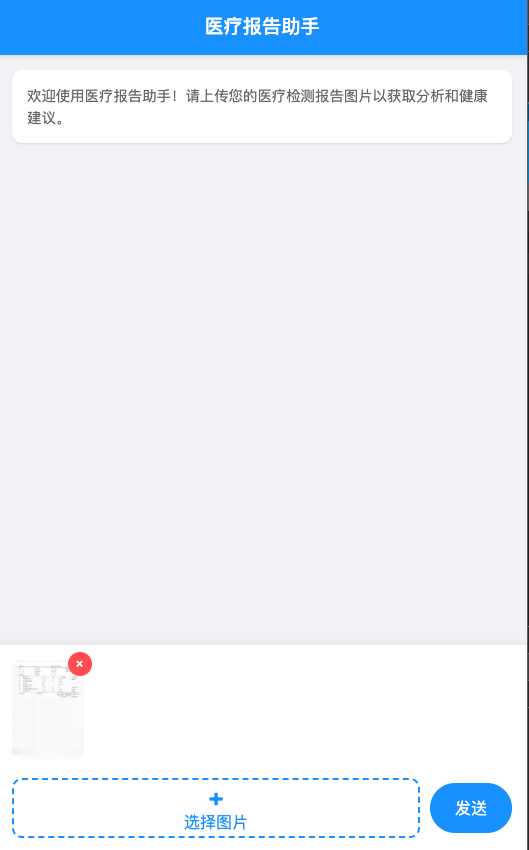
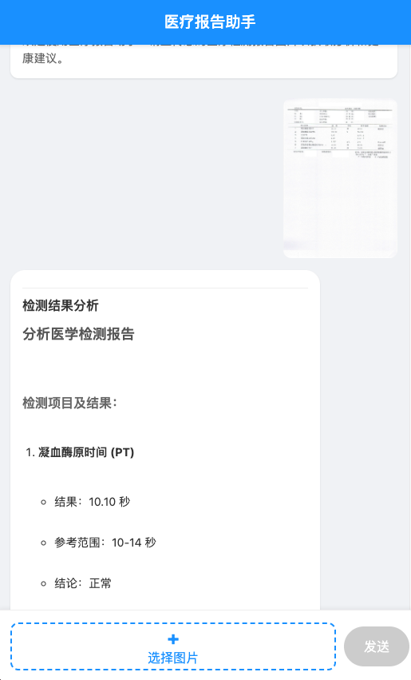

# 医疗报告助手 Web 应用

这是一个用于移动端的医疗报告分析助手Web应用。用户可以通过该应用上传医疗检测报告图片，并获得专业的分析结果和健康建议。

## 功能特点

- 移动端友好的响应式设计
- 支持本地图片上传
- 实时显示上传进度和等待动画
- 与后端AI服务通信，获取医疗报告分析结果
- 支持Markdown格式的分析结果和健康建议展示
- 完善的错误处理机制

## 技术栈

- 原生HTML5
- 原生CSS3
- 原生JavaScript (无任何外部库依赖)

## 使用方法

1. 确保后端服务已在运行（默认端口80）
2. 通过HTTP服务器访问本应用（由于CORS限制，不能直接打开index.html）
3. 点击"选择图片"按钮选择本地医疗报告图片
4. 点击"发送"按钮上传图片
5. 等待服务器处理并查看分析结果和健康建议

## 界面截图

### 主界面和图片选择


### 上传图片和等待动画


### 分析结果展示


## 代码结构

```
HealthAssistantWebApp/
├── index.html          # 主页面
├── style.css           # 样式文件
├── script.js           # 业务逻辑
├── screenshot1.png     # 界面截图
├── screenshot2.png     # 界面截图
├── screenshot3.png     # 界面截图
└── README.md           # 说明文档
```

## 与后端服务通信

本应用通过HTTP POST请求与后端服务通信：

- **地址**: `http://127.0.0.1:80`
- **端点**: `/analyze_medical_report`
- **方法**: POST
- **数据格式**: multipart/form-data

## Markdown 支持

应用内置了轻量级的Markdown解析器，支持以下语法：

- 标题 (#, ##, ###, ####, #####, ######)
- 粗体 (**text** 或 __text__)
- 斜体 (*text* 或 _text_)
- 无序列表 (- item 或 * item)
- 有序列表 (1. item)
- 换行

## 跨域处理

为了解决跨域问题，后端服务已配置CORS支持：

```python
@app.after_request
def after_request(response):
    response.headers.add('Access-Control-Allow-Origin', '*')
    response.headers.add('Access-Control-Allow-Headers', 'Content-Type,Authorization')
    response.headers.add('Access-Control-Allow-Methods', 'GET,PUT,POST,DELETE,OPTIONS')
    return response
```

## 错误处理

应用包含完善的错误处理机制：

- 网络连接错误提示
- 服务器响应错误解析
- 请求超时处理（60秒超时）
- 详细的错误信息显示

## 开发规范

- 遵循移动端Web开发规范，图片最大显示高度限制为200px
- 使用相对路径避免跨域问题
- 增强错误处理机制，包括详细的错误解析和超时处理
- 提供具体明确的错误提示信息